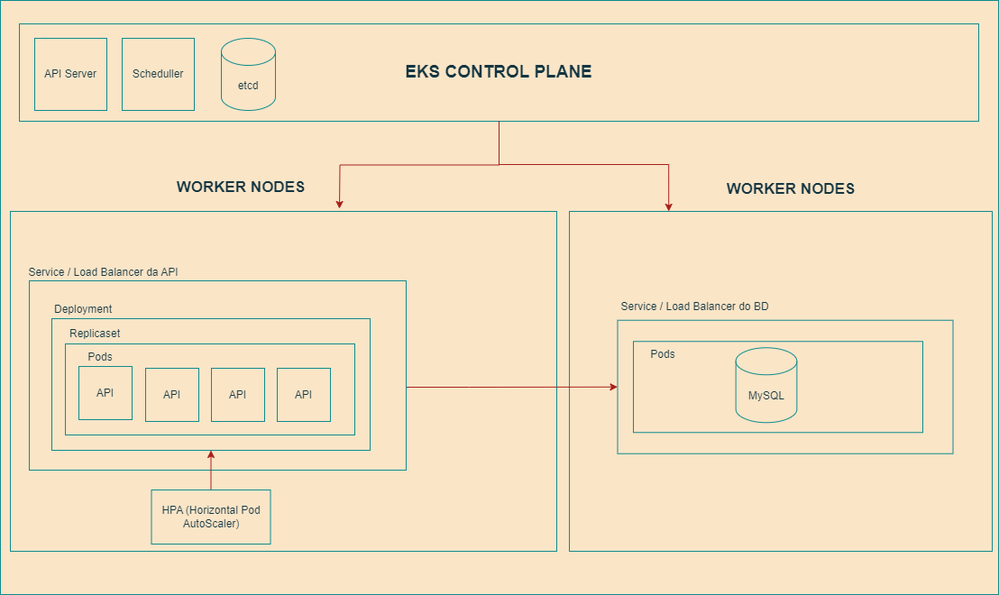

# FIAP - Arquitetura de Software -> Sistema de Pedido

## Descrição do Projeto

Este projeto é um sistema de pedido desenvolvido em Java Spring Boot, que permite aos clientes fazerem pedidos personalizados, realizar pagamentos via QRCode do Mercado Pago, acompanhar o status do pedido e receber notificações quando o pedido estiver pronto. O sistema também inclui funcionalidades de gerenciamento de clientes, produtos e categorias, e um painel administrativo para acompanhamento de pedidos.

## Funcionalidades

### Pedido
- **Identificação do Cliente**: Clientes podem se identificar via CPF, nome e e-mail, ou optar por não se identificar.
- **Montagem de Combo**: Clientes podem montar seus combos selecionando:
  - Lanche
  - Acompanhamento
  - Bebida
  - Sobremesa
- Cada etapa exibe o nome, descrição e preço dos produtos.

### Pagamento
- **QRCode Mercado Pago**: Opção de pagamento integrada usando QRCode.

### Acompanhamento
- **Status do Pedido**: Monitoramento em tempo real das etapas do pedido:
  - Recebido
  - Em preparação
  - Pronto
  - Finalizado

### Entrega
- **Notificação**: Notificação ao cliente quando o pedido estiver pronto para retirada.

### Gerenciamento
- **Clientes**: Identificação para campanhas promocionais.
- **Produtos e Categorias**: Gestão de produtos com nome, categoria, preço, descrição e imagens.
- **Pedidos**: Acompanhamento de pedidos em andamento e tempo de espera.

## Entregáveis da 2ª Fase

1. **Arquitetura Kubernates**
    - Escalabilidade com aumento e diminuição de Pods conforme demanda.
    - Disponibilizar Banco de Dados em uma pod
    - Configuração da API no EKS rodando com toda estrutura:
         - Deployment
         - Replicaset
         - Services
         - Pod
         - HPA
           


- Link do video com a demonstração da arquitetura K8s rodando no EKS: https://youtu.be/U7E9I8mxCUY

2. **Aplicação Backend**
    - Refatoração Clean Architecture
    - APIs:
        - Checkout Pedido que deverá receber os produtos solicitados e retornar a identificação do pedido.
        - Consultar status pagamento pedido, que informa se o pagamento foi aprovado ou não.
        - Webhook para receber confirmação de pagamento aprovado ou recusado.
        - A lista de pedidos deverá retorná-los com suas descrições, ordenados com a seguinte regra:
          - Pronto > Em Preparação > Recebido;
          - Pedidos mais antigos primeiro e mais novos depois;
          - Pedidos com status Finalizado não devem aparecer na lista.
      - Atualizar o status do pedido.      
    
3. **Manual de utilização das APIs**
    - importar no postman collection disponibilizada na raiz do projeto com nome de "FastFood.postman_collection.json"
     [Baixar Collection FastFood-App](FastFood.postman_collection.json)
    - 1 - Executar rota "Create Custumer"
    - 2 - Executar rota "Create Product"
    - 3 - Executar rota "Create Order" informando o document do custumer criado e o id do product criado
    - 4 - Executar "Webhook payments" simulado para fazer pagamento do QRCODE informando o id do pagamento gerado na criação do pedido
    - 5 - Executar "Change Order Status" para alterar o status do pedido 

## Entregáveis da 1ª Fase

1. **Documentação do Sistema (DDD)**
   - Event Storming com todos os passos e tipos de diagrama.
   - Fluxos:
     - Realização do pedido e pagamento
     - Preparação e entrega do pedido

2. **Aplicação Backend (Monolito)**
   - Arquitetura hexagonal
   - APIs:
     - Cadastro do Cliente
     - Identificação do Cliente via CPF
     - Criação, edição e remoção de produtos
     - Busca de produtos por categoria
     - Fake checkout (envio dos produtos escolhidos para a fila)
     - Listar pedidos
     - Swagger para consumo da API
   - Banco de dados à escolha:
     - Organização da fila de pedidos no banco de dados

3. **Configuração Docker**
   - Dockerfile configurado
   - docker-compose.yml para subir o ambiente completo

## Configuração e Execução

### Pré-requisitos
- Docker
- Docker Compose

### Passos para Execução

1. Clone o repositório:
   ```bash
   git clone https://github.com/marceloebert/fiap-software-architecture-fastfood.git
   cd lanchonete

3. Suba o ambiente:
    docker-compose up --build

### Acesso ao Swagger

Para acessar a documentação Swagger da API, utilize o seguinte endpoint:
http://localhost:8080/swagger-ui.html
    
### Infraestrutura para POC

- 1 instância para banco de dados
- 1 instância para executar a aplicação

### Tecnologias Utilizadas

- Java Spring Boot
- Banco de dados MYSQL
- Docker
- Docker Compose
- Swagger

### Documentação complementar do projeto

- https://miro.com/app/board/uXjVKgPn08g=/?share_link_id=309607043599

### Licença


